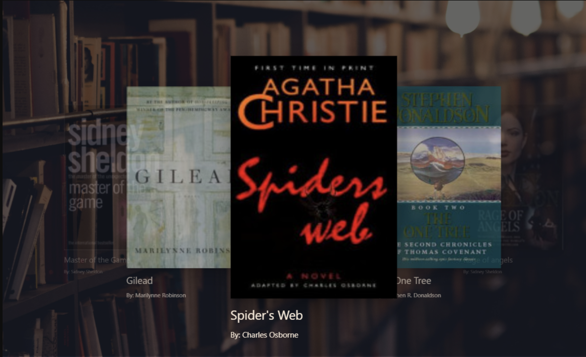
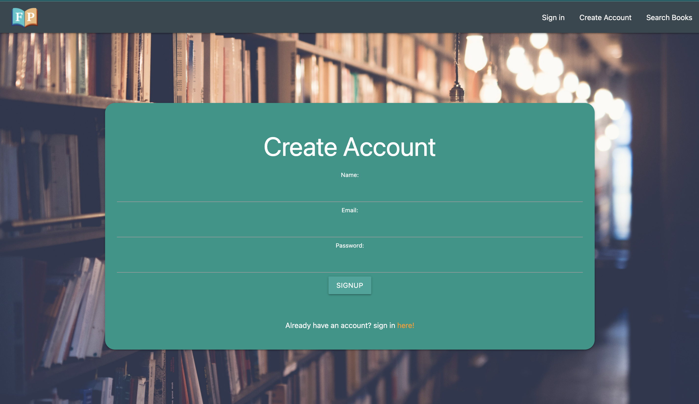
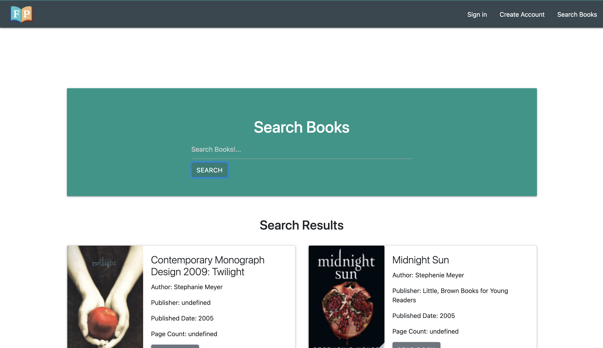

# Project 2 - Flipped Pages

*Daniel Peterman*, *Jennifer Liebelt*, *Hardik Rola*, *Naomi Smith*, *Neal Smith*

[Live webpage](https://obscure-beach-36412.herokuapp.com/)
  

 
## Overview

 Books are the key to different avenues,Flipped Pages is available to help the user get there. An array of books will be displayed on a carousel to give users ideas of where to start.  The best step is the ability to make their own account, the page that displays user interest, personality, goals and aspirations.You can learn a lot about someone based off a book selection.  Once user has made an account they are able to search for the books of their dreams! Users can also see what other users have interest in or what they have read. Once the book of choice is selected, it will be displayed after it has been searched. Users can save their books into different categories: books that they want, have read, have been suggested and wish to read. Flipped Pages is the start of making all books available to each user in seconds, we are excited to be apart of the users book journey. Come and read, imagine, discover and grow with us!  

    
## Build With 

- Handlebars - Template Language
- Materialize - Google Design language
- MySQL - Database System/Language
- Node.js - JavaScript Server Environment
- Express.js - Node.js Framework

## Usage

## Contact 
 ***Please feel free to email us or visit our project repository*** 

<a href="mailto:flipped.pages.books@gmail.com"> Email</a>

[Flipped Pages repository](https://github.com/nealsmithg/flipped_pages)
## License
- - -
 This work is licensed under a <a rel="license" href="http://creativecommons.org/licenses/by-sa/4.0/">Creative Commons Attribution-ShareAlike 4.0 International License</a>.